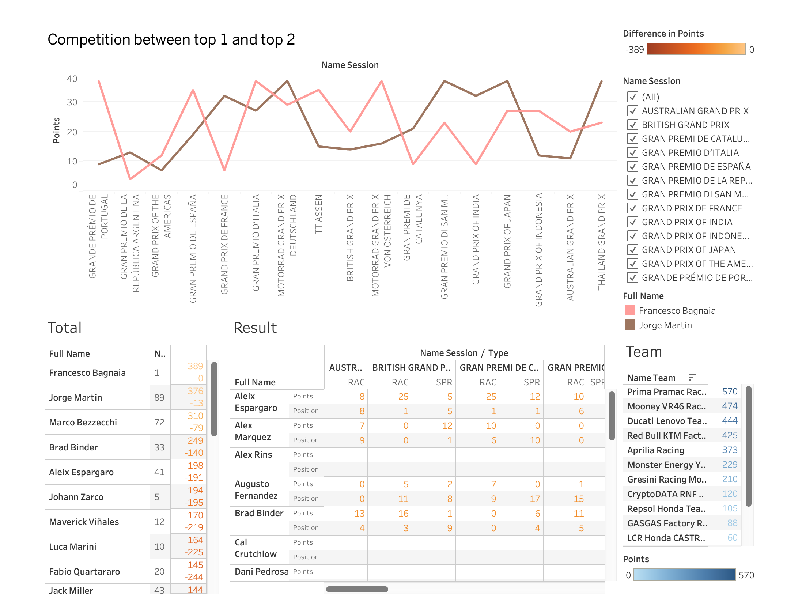

# Data Engineer Project for MotoGP

Hey there! 🏍️ Welcome to my Data Engineer project in the world of MotoGP. Get ready for a thrilling journey through the twists and turns of data collection, transformation, and loading.

## Introduction

The MotoGP Data Engineer project is more than just a project; it's an adventure filled with data-driven excitement. It all began on a casual day when I visited a friend's house to hang out and have a great time. As destiny would have it, we stumbled upon a MotoGP race and decided to watch it.

As we sat glued to the screen, witnessing the high-speed action and the jaw-dropping performance of riders like Jorge Martin, we couldn't help but be amazed. The adrenaline, the race strategy, and the incredible overtakes had us on the edge of our seats.

After the race, we couldn't stop talking about it. Jorge Martin's fiery performance became the hot topic of our discussion. His skills were so blazing that it ignited a spark in me. That's when the idea of creating a Data Engineer project was born.

And here we are! This project is the result of that fateful day, where MotoGP not only entertained us but also inspired a data-driven journey. Join me on this adventure, where data takes the center stage in the high-speed world of MotoGP.

## Table of Contents
- [Introduction](#introduction)
- [Project Overview](#project-overview)
- [Getting Started](#getting-started)
- [Data Collection](#data-collection)
- [Data Transformation](#data-transformation)
- [Data Loading](#data-loading)
- [Running the Project](#running-the-project)
- [Dashboard Tableau](#dashboard-tableau)
- [Contributing](#contributing)


## Project Overview

The MotoGP Data Engineer project involves the following key steps:

1. **Data Collection:** Obtaining data from various sources, including web scraping or utilizing APIs, to gather relevant information about MotoGP events, riders, sessions, and more.

2. **Data Transformation:** Cleaning, structuring, and transforming the collected data to make it suitable for storage and analysis. This may include handling missing values, converting data types, and structuring data into a format that aligns with the chosen storage solution.

3. **Data Loading:** Loading the transformed data into a data storage system. In this project, we are considering Apache Kafka for real-time data ingestion and Apache Cassandra for storage.

4. **Data Analysis:** Once the data is loaded, it can be analyzed to gain insights, generate reports, and support decision-making.

## Getting Started

To get started with the project, make sure you have the following prerequisites:

- Python (for data transformation and processing)
- Apache Kafka (for real-time data ingestion)
- Apache Cassandra (for data storage)
- Spark (for data processing)
- An active internet connection to access external data sources

## Data Collection

Data collection in this project is a crucial step. Depending on the specific requirements, you may choose to scrape data from websites using libraries like Beautiful Soup or utilize APIs if available.

### Web Scraping

For web scraping, you can use libraries such as Beautiful Soup or Scrapy to extract information from websites. An example of web scraping includes extracting data from the official MotoGP website.

### API Integration

I initially considered using Beautiful Soup to scrape the data, but fortunately, I was able to find an API on the official motogp.com website. This discovery simplified the data retrieval process.

APIs offer a more structured and reliable way to access data. In this project, we recommend using the official MotoGP API, which provides valuable information about events, riders, sessions, and more. The discovery of this API simplified the data retrieval process.

## Data Transformation

Data transformation involves cleaning, structuring, and converting the collected data into a format suitable for storage and analysis. This step is essential to ensure data quality and consistency.

### Transforming Object Data

If your data includes JSON or other object data stored as strings, use PySpark to convert these strings back to objects. You can use the pyspark.sql.functions.from_json function for this purpose.

## Data Loading

The data loading phase consists of ingesting data into the chosen data storage system. For this project, we recommend using Apache Kafka for real-time data ingestion and Apache Cassandra for storage.

### Apache Kafka

Apache Kafka serves as a data streaming platform that can ingest real-time data from various sources. The data can be pushed to Kafka topics and consumed by Spark for further processing.

### Apache Cassandra

Apache Cassandra is a NoSQL database suitable for storing large volumes of data. Data ingested from Kafka can be written to Cassandra tables, and it can be queried for analysis.

## Running the Project

To run the project, follow these general steps:

1. Install and set up the required software, including Python, Apache Kafka, Apache Cassandra, and Spark.

2. Collect data from the MotoGP API or relevant websites using web scraping tools or API integration.

3. Transform and clean the data to prepare it for loading.

4. Set up Kafka and create Kafka topics for data ingestion.

5. Ingest data into Kafka using Spark or any other data producer.

6. Load the data into Apache Cassandra for storage.

7. Analyze and report on the data as needed.

Please refer to the specific scripts and instructions provided with the project code for detailed implementation steps.

## Dashboard Tableau



## How to Run the MotoGP Data Engineering Project

Follow these steps to run the MotoGP Data Engineering Project on your local machine:

### Prerequisites

Before you begin, make sure you have the following software and tools installed:

- [Docker](https://www.docker.com/)
- [Docker Compose](https://docs.docker.com/compose/)

### Clone the Repository

```bash
git clone https://github.com/duonggiakhanhb/Motogp-Data-Engineering-Project.git
cd motogp-data-engineering-project
```
### Start the Docker Containers

```bash
# add permission for script
chmod +x scripts/entrypoint.sh
# start docker containers
docker-compose up -d
```

### Run the Apache Airflow DAG

```bash
# run DAG
docker exec motogp-data-engineer-project-scheduler-1 airflow dags trigger motogp_etl
```

### Submit job to Spark Cluster

```bash
# add permission for script
chmod +x scripts/spark_submit.sh
# submit job to spark cluster
./scripts/spark_submit.sh
```

### Access the Web UI
- Apache Airflow: http://localhost:8181
- Confluent Control Center: http://localhost:9021
- Apache Spark master: http://localhost:9090
- Apache Spark job history: http://localhost:4040

## Contributing

Contributions to this project are welcome. If you have suggestions, enhancements, or bug fixes, feel free to submit a pull request. Your contributions can help improve the project and make it more valuable for the MotoGP community.

## License
- License: [MIT](https://opensource.org/licenses/MIT)